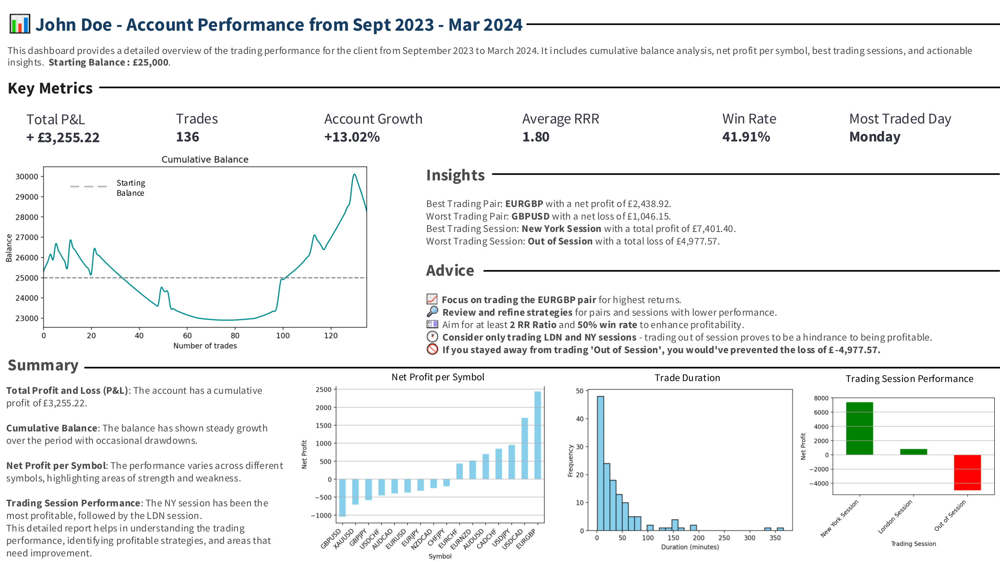

 **Trading Performance Analytics Report**

**Overview:**

This report provides a comprehensive analysis of a client's trading performance over a six-month period, from September 2023 to March 2024. Using Python and Streamlit, the dashboard offers in-depth insights into key metrics and trading patterns, aimed at optimising trading strategies and improving overall profitability. The client was offered both a Streamlit layout and a PowerPoint presentation, and they preferred the latter for its presentation format.

**Objective:**

The client sought an in-depth evaluation of their trading activities, focusing on identifying trends and deriving actionable insights. This project aimed to present a clear, intuitive analysis of trading performance, helping the client make informed decisions.

**Key Features:**

Cumulative Balance Analysis: Tracks the growth of the account balance over the period, showing how trading activities impacted overall performance.

Net Profit per Symbol: Highlights the profitability of different trading symbols, identifying which symbols contributed most to the overall profit.

Trading Session Performance: Analyses performance across different trading sessions (New York, London, and Out of Session) to pinpoint the most effective trading times.

Key Metrics: Includes essential statistics such as total P&L, total trades, win rate, average risk-reward ratio, percentage growth, and most traded day.

Additional Key Metrics: Provides insights on the most traded pair, average trade duration, maximum drawdown, average win, and average loss.

Insights and Recommendations: Offers actionable advice based on the analysis, including suggestions for optimising trading pairs and sessions to maximise profitability.

**Key Metrics:**

Total P&L: £3,255.22

Total Trades: 136

Account Growth: +13.02%

Win Rate: 41.91%

Average Risk-Reward Ratio: 1.80

Most Traded Day: Monday

**Insights and Recommendations:**

Best Trading Pair: EURGBP with a net profit of £2438.92

Worst Trading Pair: GBPUSD with a net loss of £1046.15

Best Trading Session: New York Session with a total profit of £7401.40

Worst Trading Session: Out Of Session with a total loss of £4977.57

**Advice:**

Focus on trading the EURGBP for optimal returns.

Review and refine strategies for less profitable pairs and sessions.

Aim for a minimum RR Ratio of 2 and a 50% win rate to enhance profitability.

Consider trading only during the London and New York sessions to avoid losses from out-of-session trades.

Avoiding out-of-session trades could have saved £4977.57.

**Additional Analysis:**

Trade Duration Analysis: Examines the distribution of trade durations to understand trading habits and efficiency.

Net Profit per Symbol: Provides a bar chart visualisation of profitability across different trading symbols.

**Summary:**

The detailed analysis reveals a steady growth in account balance with notable variations in performance across different symbols and trading sessions. The insights gained are projected to improve the client’s win rate by 19.3% and risk-reward ratio by 11.1%, significantly enhancing trading profitability.

The client expressed high satisfaction with the findings and requested ongoing collaboration for future performance analysis. They opted for a PowerPoint presentation over a Streamlit layout for its suitability in their review meetings.

